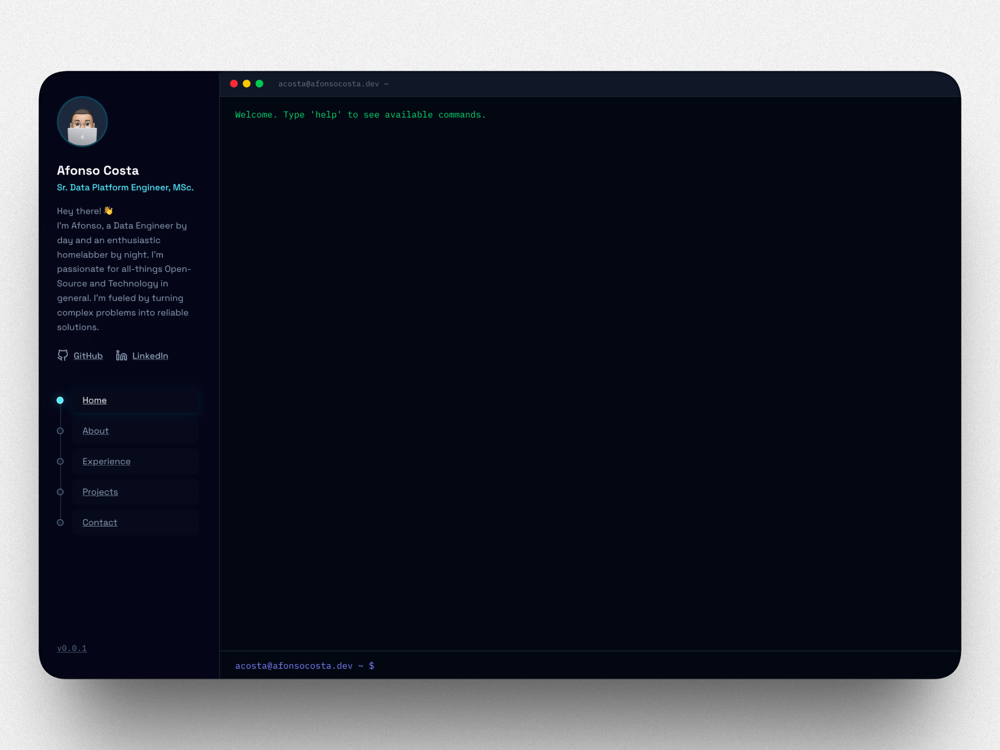

# afonsocosta.dev

[](https://github.com/afonsoc12/afonsoc12.github.io/actions/workflows/release.yml)
[](https://github.com/afonsoc12/afonsoc12.github.io/releases/latest)

A single-page personal site with a terminal-style hero, built with [Astro](https://astro.build) and [Tailwind CSS](https://tailwindcss.com), deployed to [GitHub Pages](https://docs.github.com/en/pages).

<p align="center"></p>

<p align="center">
  <a href="https://afonsocosta.dev"></a>
</p>

---

## About

Built from scratch to keep things minimal and fast — no frameworks heavier than needed, no fluff. The site presents profile, experience, projects, and contact links in a clean single-page layout with a terminal-style hero. Heavily ~~vibe-coded~~ AI-assisted. 😅

---

## Stack

|           |                                            |
| --------- | ------------------------------------------ |
| Framework | [Astro](https://astro.build) (static)      |
| Styling   | [Tailwind CSS v4](https://tailwindcss.com) |
| Language  | TypeScript                                 |
| Hosting   | GitHub Pages                               |
| CI/CD     | GitHub Actions                             |

---

## Development

```sh
npm install
npm run dev        # http://localhost:4321
npm run build      # outputs to dist/
npm run preview    # preview production build
npm run ci:check   # lint + format + type check + build
npm run ci:fix     # auto-fix lint and formatting issues
```

### Docker

```sh
docker build -t afonsocosta.dev .
docker run -p 4321:4321 -v $(pwd):/app afonsocosta.dev
```

---

## Releases

Releases are tag-driven. Bump the version with npm, then push the tag to trigger a build, GitHub Release, and GitHub Pages deployment:

```sh
npm version patch   # 0.0.5 → 0.0.6
npm version minor   # 0.0.5 → 0.1.0
npm version major   # 0.0.5 → 1.0.0

git push origin master --tags
```

---

## License

Copyright © 2026 Afonso Costa

Licensed under the MIT Licese. See the [LICENSE](License) for details.
